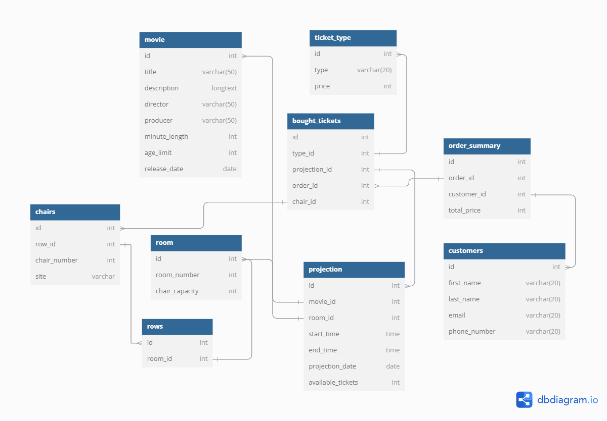

# Helpdesk

## Tartalom:
- [Maga a feladat]()
- [Maga az adatbázis]()
- [Az adatbázis]()
- [Hasznos linek]()
- [Queryk a feladatban]()
- [Magyarázat]()

## Maga a feladat:
### A feladat egy mozi jegyeladási rendszerének adatbázis oldalát megtervezni és lekódolni. 

#### Leírás és feltételek:
- Tárolunk kell filmeket, illetve a filmekhez kapcsolódóan vetítéseket.
- A vetítések különböző termekben vannak lebonyolítva.
- A filmeknek hossza van, illetve a vetítéseknek a kezdési időpontja.
- A vevőket be akarjuk regisztrálni a rendszerbe.
- A termeknek van egy max. kapacitása.
- A vevők vetítésekre vesznek jegye(ke)t.
- A jegyeknek van ára, illetve egy adott sorba és helyre szólnak.
- Egy vásárlás keretén belül több jegyet is lehet vásárolni egyszerre.

#### Automatizalandó feladatok:
- Egy rendelés végösszegének kiszámítása
- Egy vetítés felvitelekor, hogy nem ütközik-e más vetítésekkel
- Jegyvásárlásnál, hogy az adott vetítésre foglalt-e az adott hely

## Maga az adatbázis:

## Hasznos linkek:
- [Pakesz által tartott adatbázis tervezős korep összes anyaga](https://drive.google.com/drive/folders/14G32jQXYLvc0nhQJN-ccZO63e06fr1wC?usp=sharing)

- [Fullosabb trigger magyarzó](https://www.geeksforgeeks.org/sql-trigger-student-database/)

- [Postgre Docs](https://www.postgresql.org/docs/)

- [dbdiagram.io](https://dbdiagram.io/home)

## Queryk a feladatban: 

## Magyarázat:
### MySQL vs PostgreSQL röviden:
- Közös: A két "nyelv"ben többek között az a közös, hogy mindkettő SQL-en alapszik, támogatják a JSON (Javascript Object Notation) formátumot, illetve mind kettő egy RDBMS (Relational Database Management System) --> az adatokat táblákba rendezik. 

- PostgreSQL: MySQL-el szembe maga a Postgre egy sokkal nagyobb performance-el illetve összetebb műveletekre használható "nyelv".

- MySQL: Általában kisebb webappokhoz szokás használni. A MySQL-t a Postgrevel szemben könnyebb használni, jobban felhasználó barátabb. 

[Magyarázó videó](https://www.youtube.com/watch?v=btjBNKP49Rk)

### Triggerek: 
- Magát a triggert akkor használjuk, ha valamilyen művelet hatására végre szeretetnénk hajtani egy adott dolgott az adatbázison automatikusan. 

- Három főbb fajtája van: DDL, DML, Logon

- Amit mi használtunk:  DML - Data Manipulation Language: INSERT, UPDATE, DELETE művelet hatására lép életbe
            
[Fullos trigger magyarázó](https://www.geeksforgeeks.org/sql-trigger-student-database/)

### Adatbázis tervezés:
#### 3 fő részre lehet osztani: 
0. Téma meghatározása
1. Felveszünk mindent ami eszünkbe jut hogy kellhet 
2. Kategóriába rendezzük az első lépésben felírt elemeket 
3. Létrehozzuk a szükséges table-ket és vizsgáljuk a kapcsolatokat

[Pakesz által tartott adatbázis tervezős korep összes anyaga](https://drive.google.com/drive/folders/14G32jQXYLvc0nhQJN-ccZO63e06fr1wC?usp=sharing)

## Fogalmak:    